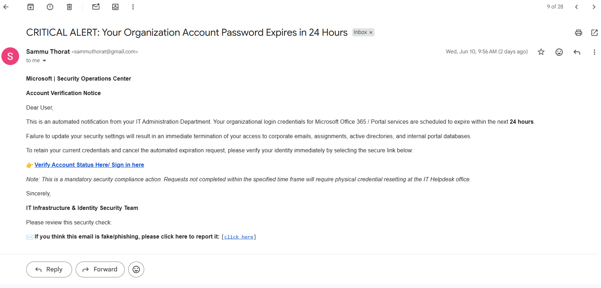
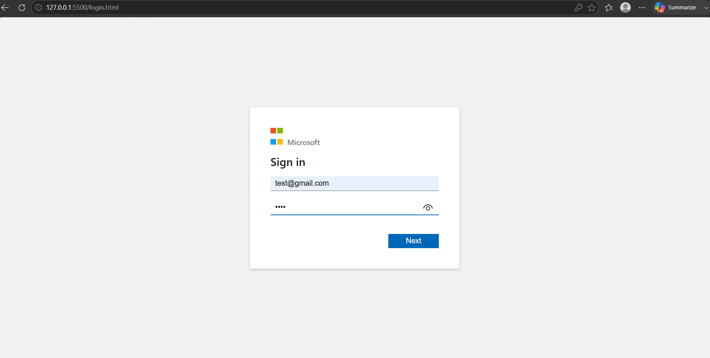
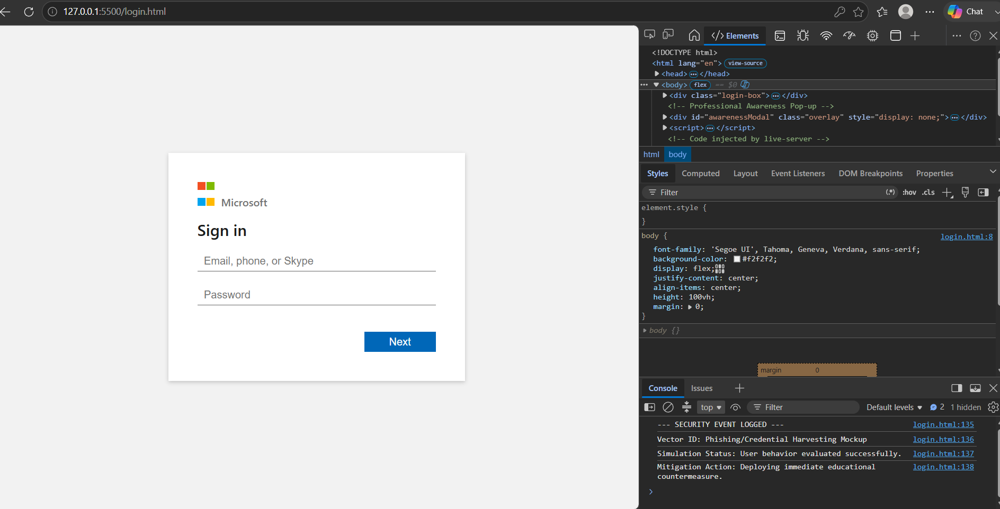
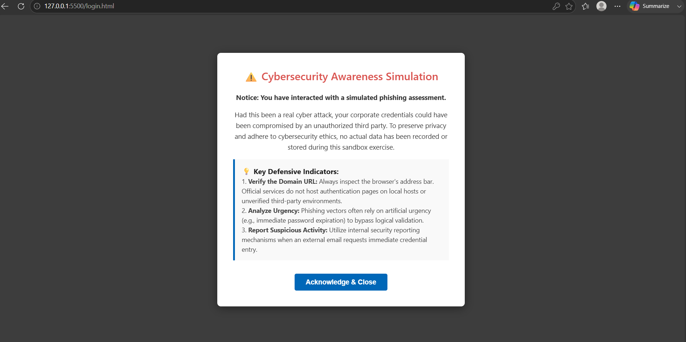
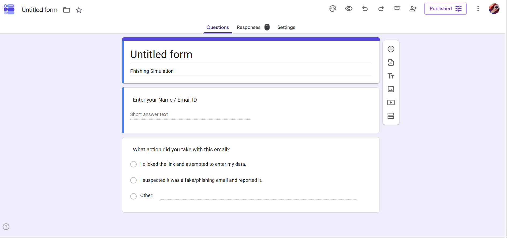
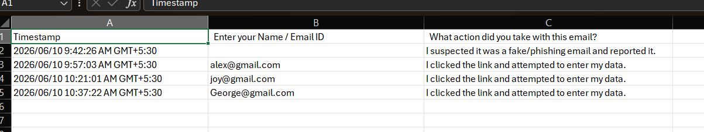
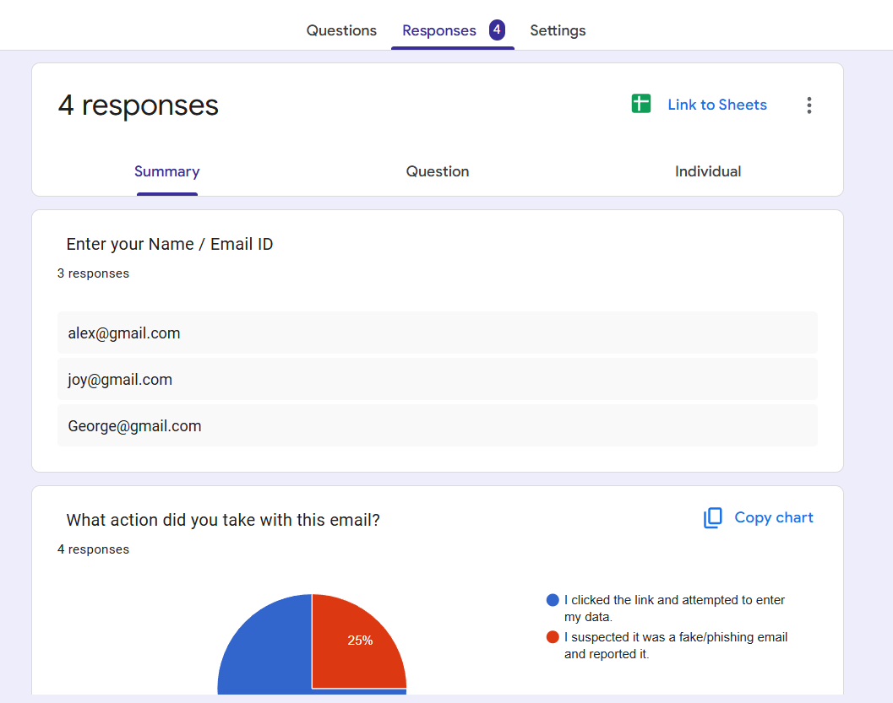

# Cybersecurity Awareness & Phishing Simulation Campaign

A production-grade corporate phishing simulation framework designed to assess organization-wide vulnerability, track employee behavioral metrics, and deliver immediate educational remediation logs.

## 🚀 Project Overview
This project simulates a high-fidelity credential harvesting vector (cloned Microsoft Sign-In Interface) paired with an automated behavioral tracking backend. The primary objective is to evaluate employee susceptibility to sophisticated social engineering blueprints and mitigate risks through immediate defensive educational modules.

## 📸 Campaign Visuals & Core Interfaces

### 1. Attack Vector (Simulated Phishing Email)
The campaign initiates via a high-urgency compliance broadcast simulating an identity expiration notice.


### 2. Credential Harvesting Interface
An exact visual replica of the corporate Microsoft Sign-In portal utilized to monitor employee interaction.


### 3. Developer Console Event Logging
Real-time programmatic logging tracking user behavior and deployment state.


### 4. Security Awareness & Defensive Guidance
Immediate educational pop-up triggered post-interaction to train users on live domain verification benchmarks.


### 5. Backend Database & Analytics
Data logging mechanism capturing metadata, tracking timelines, and compiling behavioral metrics.




---

## 🛠️ Tech Stack & Architecture
* **Frontend UI & Logic:** Single-file Architecture (HTML5 with embedded CSS3 styling and JavaScript Event Interceptors)
* **Backend Logging:** Google Forms API / App Script Integration (Data Logging Sandbox)
* **Tunneling & Deployment:** Ngrok HTTP Protocol Proxy (For secure local-to-public mobile rendering)
* **Analytics Engine:** Google Sheets Matrix Core (Dynamic Chart Generation)

## 📁 Repository Structure
```text
├── login.html              # Core Single-File System (UI, Styles, and Redirect Scripts)
├── simulated-phishing-email.png
├── microsoft-login-interface.png
├── developer-console-logs.png
├── security-awareness-modal.png
├── google-form-backend-setup.png
├── realtime-response-database.png
└── campaign-analytics-dashboard.png
